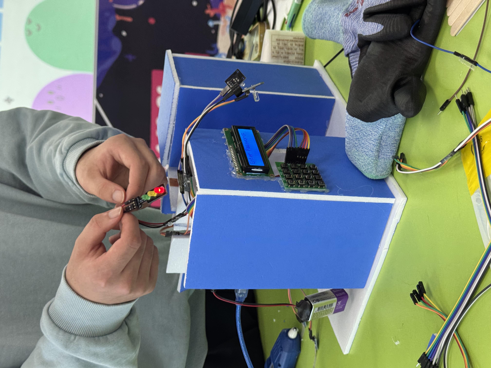
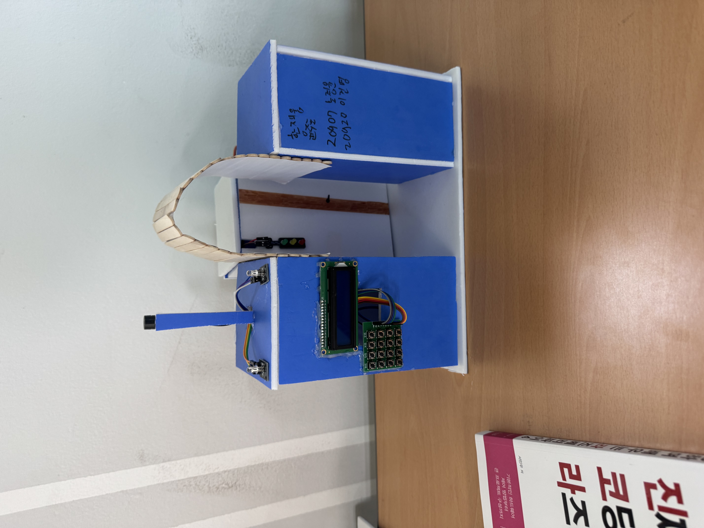
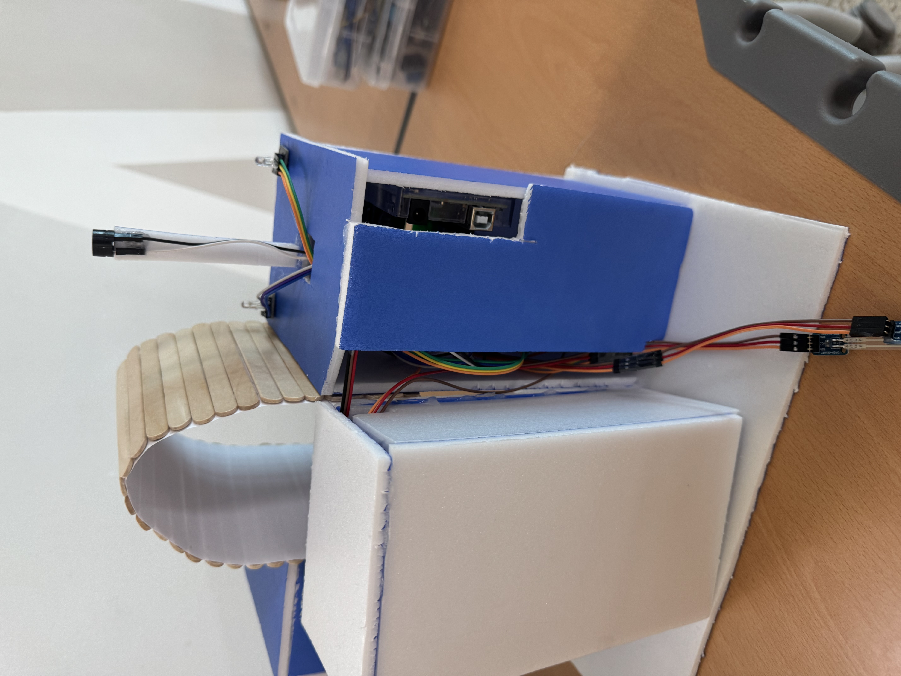

# Master_Creator_Challenge

> **2024 마스터 크리에이터 챌린지**
>
> **스마트 도어락 시스템**
>

---

## 프로젝트 개요
이 프로젝트는 아두이노를 기반으로 한 **비밀번호 입력 방식의 디지털 도어락**입니다. 
키패드를 통한 비밀번호 인증, 서보모터를 이용한 물리적 잠금 제어, 그리고 LCD와 LED를 통한 직관적인 상태 표시 기능을 갖추고 있습니다.

---

## 회로 연결도 (핀맵)

| 부품 (Component) | 아두이노 핀 (Pin) | 설명 (Description) |
| :--- | :---: | :--- |
| **Servo Motor** | `D10` | 도어 잠금 장치 구동 (0°: 잠금, 90°: 해제) |
| **Piezo Buzzer** | `D11` | 키 입력음 및 침입 경보음 출력 |
| **RGB LED (Blue)** | `D13` | 인증 성공 시 점등 |
| **RGB LED (Red)** | `D12` | 침입 경보 시 점멸 |
| **Traffic LED (Green)** | `A1` | 문 열림 상태 표시 (Access Granted) |
| **Traffic LED (Red)** | `A0` | 문 잠김 상태 표시 (Locked) |
| **Button (OPEN)** | `A2` | 내부 문 열림 버튼 (Pull-up) |
| **Button (CLOSE)** | `A3` | 내부 문 잠김 버튼 (Pull-up) |
| **Keypad (Row 0~3)** | `D2` ~ `D5` | 4x4 키패드 행 연결 |
| **Keypad (Col 0~3)** | `D6` ~ `D9` | 4x4 키패드 열 연결 |
| **Bluetooth (TX, RX)** | `D1`, `D0` | 외부 통신용 (SoftwareSerial) |
| **I2C LCD** | `SDA`, `SCL` | 상태 메시지 출력 (A4, A5) |

> 블루투스 연결은 실패함

---

## 주요 기능

### 1. 비밀번호 인증 시스템
- **4x4 키패드**를 이용한 비밀번호 입력
- **기본 비밀번호 :** `123456`
- **LCD 디스플레이 :** 현재 입력 상태 및 인증 결과 실시간 출력
- **제어 키 :**
  - `#`: 비밀번호 입력 완료 (제출)
  - `*`: 입력 초기화 (오타 수정용)
  - `C`: 문이 열려있을 때 즉시 잠금 (Lock)

### 2. 보안 및 경보 (Security Alarm)
- **오류 감지 :** 등록된 비밀번호와 다른 번호 입력 시 경보 시스템 작동
- **경보 동작 :** - 부저 경고음 5회 발생
  - 적색 LED 점멸
  - LCD에 `Access Denied` 메시지 출력

### 3. 자동화 및 물리 제어
- **서보 모터 제어 :** 인증 성공 시 90도(Open), 잠금 시 0도(Close)로 회전
- **상태 LED :** 잠금 상태(빨강)와 해제 상태(초록)를 LED로 상시 표시
- **내부 버튼 :** 비밀번호 없이 문을 열거나 잠글 수 있는 물리 버튼 제공

---

## 작품 사진

